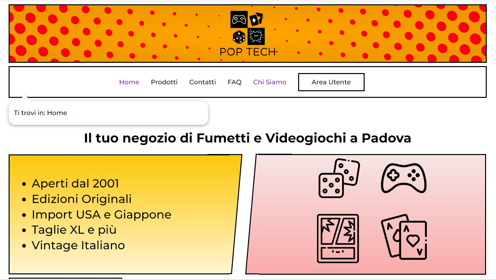
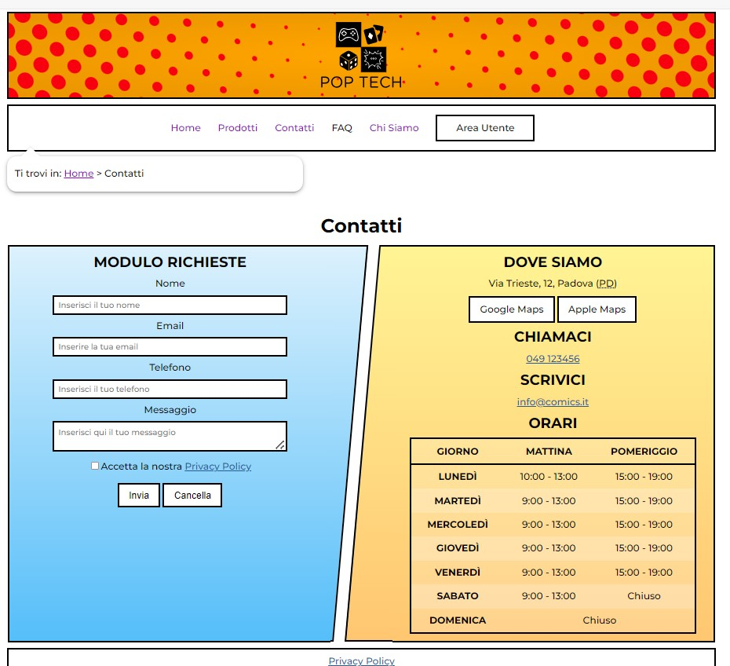
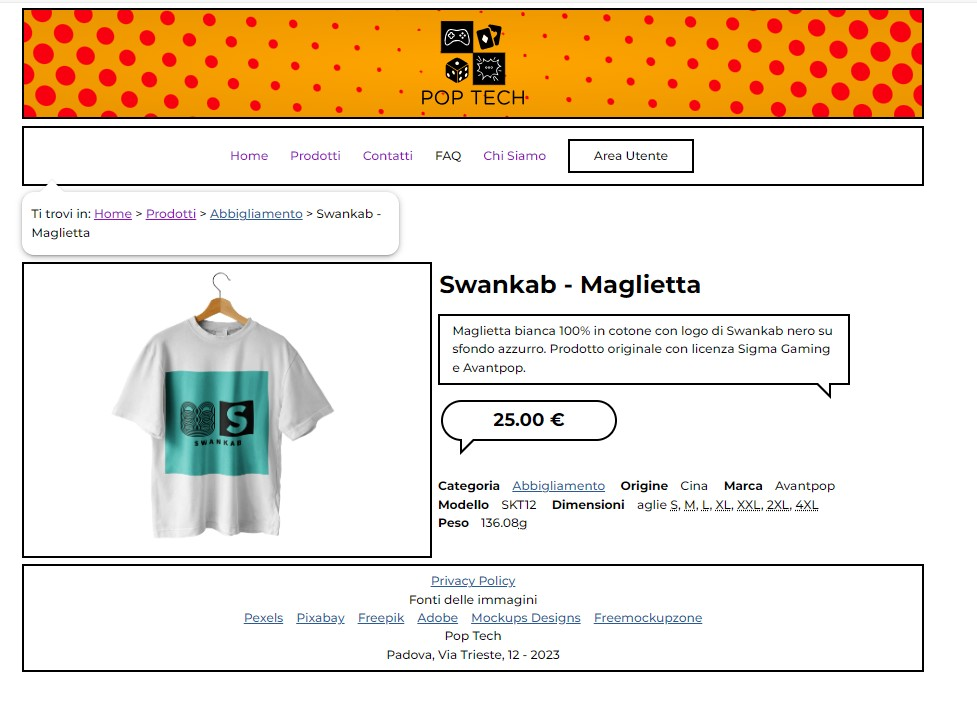

# Pop Tech

Progetto di Tecnologie Web (UniPD, 2022/2023) per il corso della prof.ssa Gaggi. Sito vetrina e gestionale di un negozio di fumetti e videogiochi a Padova, con area utente e area amministrativa.

Riconoscimenti:
- Voto: 29.5/30 (con 2 punti bonus, 30 e lode)
- Secondo posto al Concorso Accattivante e Accessibile 2022/2023

**Contenuti principali**
- Home con categorie in evidenza e prodotti recenti
- Pagine prodotti e categorie
- Area utente: registrazione, login, profilo, recensioni
- Area admin: gestione prodotti, categorie, marche, utenti, recensioni, FAQ

**Struttura**
- `index.php` e pagine pubbliche nella root
- `admin/` area amministrativa
- `area-utente/` area utente
- `layouts/` template HTML condivisi
- `includes/` utility e DB access
- `styles/`, `js/`, `images/` asset statici
- `tecweb.sql` dump del database

**Configurazione database**
Il progetto usa MySQL tramite `includes/connection.php`. Sono supportate variabili d'ambiente (con fallback):
- `DB_HOST` (default `127.0.0.1`)
- `DB_NAME` (default `poptech`)
- `DB_USER` (default `root`)
- `DB_PASS` (default `root`)

Il dump `tecweb.sql` contiene lo schema e i dati iniziali.

**Nota sul path**
In `includes/utilities.php` la costante `ROOT_FOLDER` e impostata a `/poptech/` per l'uso tipico in XAMPP (cartella `htdocs/poptech`). Se esegui il sito dalla root del virtual host (es. Docker su `http://localhost:8080/`), puoi impostarla a `/` per una corretta evidenziazione del menu.

**Esecuzione con Docker (consigliata)**
Requisiti: Docker e Docker Compose installati (se usi Docker Desktop, deve essere aperto).

**Windows (WSL2)**
Percorso di lavoro:
```bash
cd /mnt/c/Users/roves/Downloads/Pop-Tech-main
```
Avvio:
```bash
docker compose up --build
```

**Linux / macOS**
Avvio:
```bash
docker compose up --build
```

Apri:
- `http://localhost:8080/`

Reset completo del database (reimport del dump):
```bash
docker compose down -v
docker compose up --build
```

**Esecuzione in locale con XAMPP/WAMP**
1. Clona o scarica la repo dentro `htdocs` (XAMPP) o la directory equivalente.
2. Crea il database `poptech` in MySQL.
3. Importa `tecweb.sql`.
4. Apri `http://localhost/poptech`.

**Mockup Figma**
Il mockup originale e disponibile qui:
```text
https://www.figma.com/file/VKGBmJToHccll3PvxvOG05/TechWeb?node-id=0%3A1&t=BvfcF5MTfd44gOxZ-0
```

**Screenshot**



